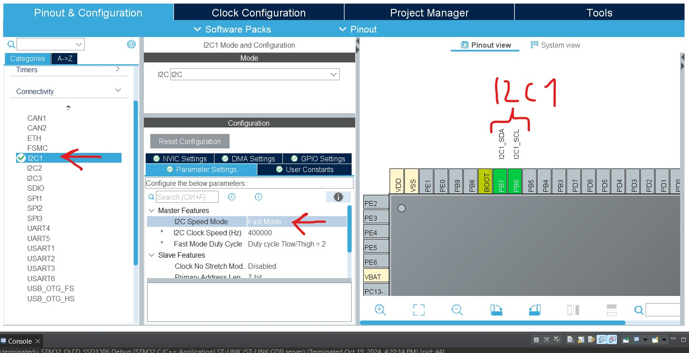
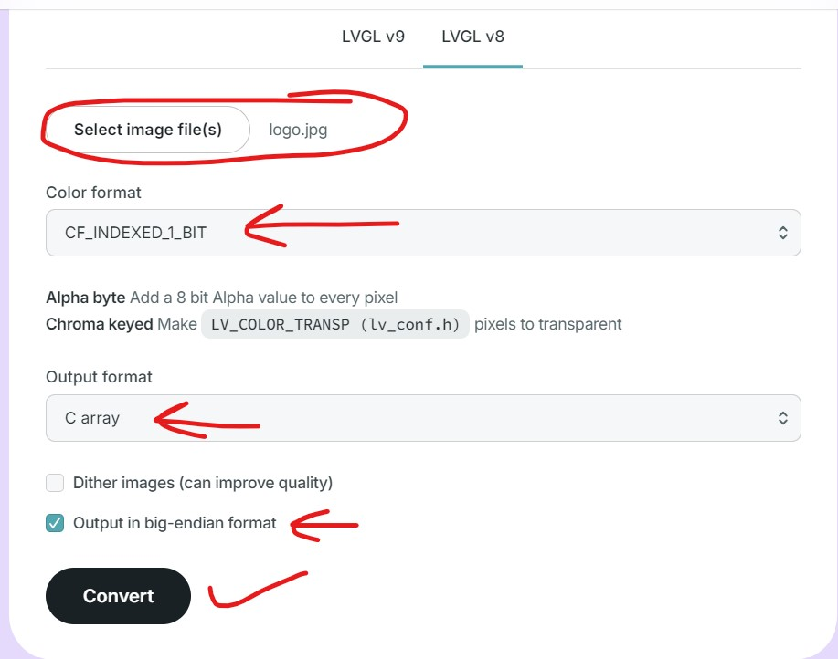
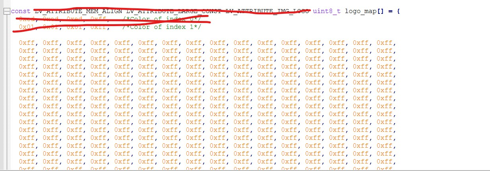
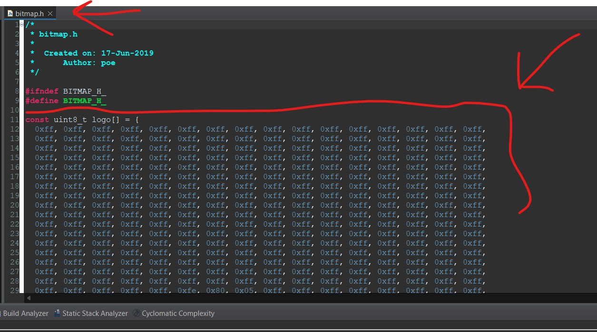
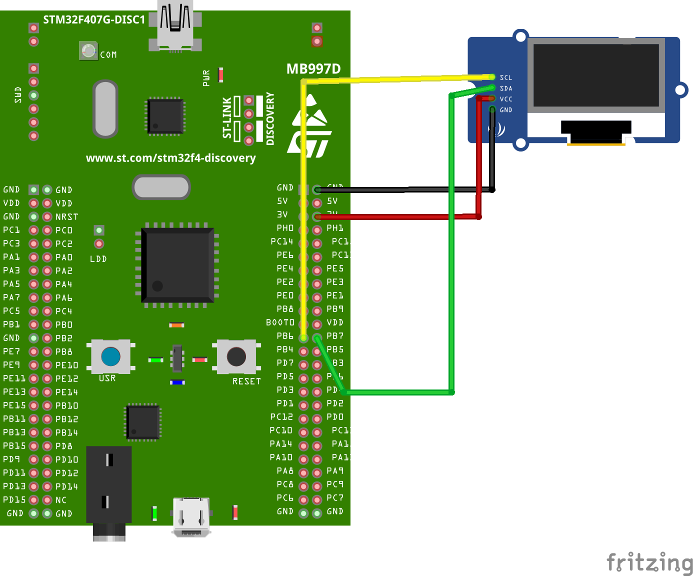

# STM32 OLED SSD1306
A project that provides writing with a OLED SSD1306 using STM32

- ***Link headers***
  - [NOTE](#note)<br/>
  - [Image Mirroring](#image-mirroring)<br/>
  - [Circuit](#circuit)<br/>
  - [Main Code](#code-mainc)<br/>
  - [SSD1306 Code](#code-ssd1306c)<br/>

## NOTE
> [!NOTE]
> You need to set which I2C to use in the "ssd1306.c" file

> [!NOTE]
> The I2C module must be set to FAST mode


## Image Mirroring
From <a href="https://lvgl.io/tools/imageconverter"> here </a> we convert our image, which is 128x64 pixels, to a c array variable

***
We delete the specified places

***
This is how we transfer it into the "bitmap.h" file

***
## Circuit


## Code "main.c"
```c++
/* USER CODE BEGIN Header */
/**
  ******************************************************************************
  * @file           : main.c
  * @brief          : Main program body
  ******************************************************************************
  * @attention
  *
  * Copyright (c) 2024 STMicroelectronics.
  * All rights reserved.
  *
  * This software is licensed under terms that can be found in the LICENSE file
  * in the root directory of this software component.
  * If no LICENSE file comes with this software, it is provided AS-IS.
  *
  ******************************************************************************
  */
/* USER CODE END Header */
/* Includes ------------------------------------------------------------------*/
#include "main.h"

/* Private includes ----------------------------------------------------------*/
/* USER CODE BEGIN Includes */


#include "ssd1306.h"
#include "fonts.h"
#include "stdio.h"
#include "bitmap.h"
#include "horse_anim.h"


/* USER CODE END Includes */

/* Private typedef -----------------------------------------------------------*/
/* USER CODE BEGIN PTD */

/* USER CODE END PTD */

/* Private define ------------------------------------------------------------*/
/* USER CODE BEGIN PD */

/* USER CODE END PD */

/* Private macro -------------------------------------------------------------*/
/* USER CODE BEGIN PM */

/* USER CODE END PM */

/* Private variables ---------------------------------------------------------*/
I2C_HandleTypeDef hi2c1;

/* USER CODE BEGIN PV */

/* USER CODE END PV */

/* Private function prototypes -----------------------------------------------*/
void SystemClock_Config(void);
static void MX_GPIO_Init(void);
static void MX_I2C1_Init(void);
/* USER CODE BEGIN PFP */

/* USER CODE END PFP */

/* Private user code ---------------------------------------------------------*/
/* USER CODE BEGIN 0 */

/* USER CODE END 0 */

/**
  * @brief  The application entry point.
  * @retval int
  */
int main(void)
{

  /* USER CODE BEGIN 1 */

  /* USER CODE END 1 */

  /* MCU Configuration--------------------------------------------------------*/

  /* Reset of all peripherals, Initializes the Flash interface and the Systick. */
  HAL_Init();

  /* USER CODE BEGIN Init */

  /* USER CODE END Init */

  /* Configure the system clock */
  SystemClock_Config();

  /* USER CODE BEGIN SysInit */

  /* USER CODE END SysInit */

  /* Initialize all configured peripherals */
  MX_GPIO_Init();
  MX_I2C1_Init();
  /* USER CODE BEGIN 2 */


  //  SSD1306_Init (); // initialise the display
  //  SSD1306_GotoXY (10,10); // goto 10, 10
  //  SSD1306_Puts ("HELLO", &Font_11x18, 1); // print Hello
  //  SSD1306_GotoXY (10, 30);
  //  SSD1306_Puts ("WORLD !!", &Font_11x18, 1);
  //  SSD1306_UpdateScreen(); // update screen

  //  int num = 123456; float flt = 123.45;
  //  char bufnum[7]; char bufflt[7];
  //  SSD1306_Init (); // initialise the display
  //  sprintf (bufnum, "%d", num);
  //  sprintf (bufflt, "%.2f", flt);
  //  SSD1306_GotoXY (10,10); // goto 10, 10
  //  SSD1306_Puts (bufnum, &Font_11x18, 1); // print Hello
  //  SSD1306_GotoXY (10, 30);
  //  SSD1306_Puts (bufflt, &Font_11x18, 1);
  //  SSD1306_UpdateScreen(); // update screen

  //  SSD1306_Init();
  //  SSD1306_DrawBitmap(0, 0, logo, 128, 64, 1);
  //  SSD1306_UpdateScreen(); // update screen


    SSD1306_Init();
    SSD1306_Clear();
    SSD1306_DrawBitmap(0, 0, logo, 128, 64, 1);
    SSD1306_UpdateScreen(); // update screen

    SSD1306_ScrollRight(0x00, 0x07);    // scroll entire screen (Page0 to Page7) right
    HAL_Delay (5000);
    SSD1306_Stopscroll();

    SSD1306_ScrollLeft(0x00, 0x07);    // scroll entire screen (Page0 to Page7) right
    HAL_Delay (5000);
    SSD1306_Stopscroll();


  /* USER CODE END 2 */

  /* Infinite loop */
  /* USER CODE BEGIN WHILE */
  while (1)
  {
    /* USER CODE END WHILE */

    /* USER CODE BEGIN 3 */

	  //// HORSE ANIMATION START //////

	  	  SSD1306_Clear();
	  	  SSD1306_DrawBitmap(0,0,horse1,128,64,1);
	  	  SSD1306_UpdateScreen();

	  	  SSD1306_Clear();
	  	  SSD1306_DrawBitmap(0,0,horse2,128,64,1);
	  	  SSD1306_UpdateScreen();

	  	  SSD1306_Clear();
	  	  SSD1306_DrawBitmap(0,0,horse3,128,64,1);
	  	  SSD1306_UpdateScreen();

	  	  SSD1306_Clear();
	  	  SSD1306_DrawBitmap(0,0,horse4,128,64,1);
	  	  SSD1306_UpdateScreen();

	  	  SSD1306_Clear();
	  	  SSD1306_DrawBitmap(0,0,horse5,128,64,1);
	  	  SSD1306_UpdateScreen();

	  	  SSD1306_Clear();
	  	  SSD1306_DrawBitmap(0,0,horse6,128,64,1);
	  	  SSD1306_UpdateScreen();


	  	  SSD1306_Clear();
	  	  SSD1306_DrawBitmap(0,0,horse7,128,64,1);
	  	  SSD1306_UpdateScreen();

	  	  SSD1306_Clear();
	  	  SSD1306_DrawBitmap(0,0,horse8,128,64,1);
	  	  SSD1306_UpdateScreen();


	  	  SSD1306_Clear();
	  	  SSD1306_DrawBitmap(0,0,horse9,128,64,1);
	  	  SSD1306_UpdateScreen();


	  	  SSD1306_Clear();
	  	  SSD1306_DrawBitmap(0,0,horse10,128,64,1);
	  	  SSD1306_UpdateScreen();

	  	  //// HORSE ANIMATION ENDS //////


  }
  /* USER CODE END 3 */
}

/**
  * @brief System Clock Configuration
  * @retval None
  */
void SystemClock_Config(void)
{
  RCC_OscInitTypeDef RCC_OscInitStruct = {0};
  RCC_ClkInitTypeDef RCC_ClkInitStruct = {0};

  /** Configure the main internal regulator output voltage
  */
  __HAL_RCC_PWR_CLK_ENABLE();
  __HAL_PWR_VOLTAGESCALING_CONFIG(PWR_REGULATOR_VOLTAGE_SCALE1);

  /** Initializes the RCC Oscillators according to the specified parameters
  * in the RCC_OscInitTypeDef structure.
  */
  RCC_OscInitStruct.OscillatorType = RCC_OSCILLATORTYPE_HSI;
  RCC_OscInitStruct.HSIState = RCC_HSI_ON;
  RCC_OscInitStruct.HSICalibrationValue = RCC_HSICALIBRATION_DEFAULT;
  RCC_OscInitStruct.PLL.PLLState = RCC_PLL_ON;
  RCC_OscInitStruct.PLL.PLLSource = RCC_PLLSOURCE_HSI;
  RCC_OscInitStruct.PLL.PLLM = 8;
  RCC_OscInitStruct.PLL.PLLN = 168;
  RCC_OscInitStruct.PLL.PLLP = RCC_PLLP_DIV2;
  RCC_OscInitStruct.PLL.PLLQ = 7;
  if (HAL_RCC_OscConfig(&RCC_OscInitStruct) != HAL_OK)
  {
    Error_Handler();
  }

  /** Initializes the CPU, AHB and APB buses clocks
  */
  RCC_ClkInitStruct.ClockType = RCC_CLOCKTYPE_HCLK|RCC_CLOCKTYPE_SYSCLK
                              |RCC_CLOCKTYPE_PCLK1|RCC_CLOCKTYPE_PCLK2;
  RCC_ClkInitStruct.SYSCLKSource = RCC_SYSCLKSOURCE_PLLCLK;
  RCC_ClkInitStruct.AHBCLKDivider = RCC_SYSCLK_DIV1;
  RCC_ClkInitStruct.APB1CLKDivider = RCC_HCLK_DIV4;
  RCC_ClkInitStruct.APB2CLKDivider = RCC_HCLK_DIV2;

  if (HAL_RCC_ClockConfig(&RCC_ClkInitStruct, FLASH_LATENCY_5) != HAL_OK)
  {
    Error_Handler();
  }
}

/**
  * @brief I2C1 Initialization Function
  * @param None
  * @retval None
  */
static void MX_I2C1_Init(void)
{

  /* USER CODE BEGIN I2C1_Init 0 */

  /* USER CODE END I2C1_Init 0 */

  /* USER CODE BEGIN I2C1_Init 1 */

  /* USER CODE END I2C1_Init 1 */
  hi2c1.Instance = I2C1;
  hi2c1.Init.ClockSpeed = 400000;
  hi2c1.Init.DutyCycle = I2C_DUTYCYCLE_2;
  hi2c1.Init.OwnAddress1 = 0;
  hi2c1.Init.AddressingMode = I2C_ADDRESSINGMODE_7BIT;
  hi2c1.Init.DualAddressMode = I2C_DUALADDRESS_DISABLE;
  hi2c1.Init.OwnAddress2 = 0;
  hi2c1.Init.GeneralCallMode = I2C_GENERALCALL_DISABLE;
  hi2c1.Init.NoStretchMode = I2C_NOSTRETCH_DISABLE;
  if (HAL_I2C_Init(&hi2c1) != HAL_OK)
  {
    Error_Handler();
  }
  /* USER CODE BEGIN I2C1_Init 2 */

  /* USER CODE END I2C1_Init 2 */

}

/**
  * @brief GPIO Initialization Function
  * @param None
  * @retval None
  */
static void MX_GPIO_Init(void)
{
/* USER CODE BEGIN MX_GPIO_Init_1 */
/* USER CODE END MX_GPIO_Init_1 */

  /* GPIO Ports Clock Enable */
  __HAL_RCC_GPIOA_CLK_ENABLE();
  __HAL_RCC_GPIOB_CLK_ENABLE();

/* USER CODE BEGIN MX_GPIO_Init_2 */
/* USER CODE END MX_GPIO_Init_2 */
}

/* USER CODE BEGIN 4 */

/* USER CODE END 4 */

/**
  * @brief  This function is executed in case of error occurrence.
  * @retval None
  */
void Error_Handler(void)
{
  /* USER CODE BEGIN Error_Handler_Debug */
  /* User can add his own implementation to report the HAL error return state */
  __disable_irq();
  while (1)
  {
  }
  /* USER CODE END Error_Handler_Debug */
}

#ifdef  USE_FULL_ASSERT
/**
  * @brief  Reports the name of the source file and the source line number
  *         where the assert_param error has occurred.
  * @param  file: pointer to the source file name
  * @param  line: assert_param error line source number
  * @retval None
  */
void assert_failed(uint8_t *file, uint32_t line)
{
  /* USER CODE BEGIN 6 */
  /* User can add his own implementation to report the file name and line number,
     ex: printf("Wrong parameters value: file %s on line %d\r\n", file, line) */
  /* USER CODE END 6 */
}
#endif /* USE_FULL_ASSERT */
```

## Code "ssd1306.c"
```c++
/**
#include "ssd1306.h"

extern I2C_HandleTypeDef hi2c1;
#define SSD1306_I2C &hi2c1


/* Write command */
#define SSD1306_WRITECOMMAND(command)      ssd1306_I2C_Write(SSD1306_I2C_ADDR, 0x00, (command))
/* Write data */
#define SSD1306_WRITEDATA(data)            ssd1306_I2C_Write(SSD1306_I2C_ADDR, 0x40, (data))
/* Absolute value */
#define ABS(x)   ((x) > 0 ? (x) : -(x))

/* SSD1306 data buffer */
static uint8_t SSD1306_Buffer[SSD1306_WIDTH * SSD1306_HEIGHT / 8];

/* Private SSD1306 structure */
typedef struct {
	uint16_t CurrentX;
	uint16_t CurrentY;
	uint8_t Inverted;
	uint8_t Initialized;
} SSD1306_t;

/* Private variable */
static SSD1306_t SSD1306;


uint8_t SSD1306_Init(void) {

	/* Init I2C */
	ssd1306_I2C_Init();
	
	/* Check if LCD connected to I2C */
	if (HAL_I2C_IsDeviceReady(SSD1306_I2C, SSD1306_I2C_ADDR, 1, 20000) != HAL_OK) {
		/* Return false */
		return 0;
	}
	
	/* A little delay */
	uint32_t p = 2500;
	while(p>0)
		p--;
	
	/* Init LCD */
	SSD1306_WRITECOMMAND(0xAE); //display off
	SSD1306_WRITECOMMAND(0x20); //Set Memory Addressing Mode   
	SSD1306_WRITECOMMAND(0x10); //00,Horizontal Addressing Mode;01,Vertical Addressing Mode;10,Page Addressing Mode (RESET);11,Invalid
	SSD1306_WRITECOMMAND(0xB0); //Set Page Start Address for Page Addressing Mode,0-7
	SSD1306_WRITECOMMAND(0xC8); //Set COM Output Scan Direction
	SSD1306_WRITECOMMAND(0x00); //---set low column address
	SSD1306_WRITECOMMAND(0x10); //---set high column address
	SSD1306_WRITECOMMAND(0x40); //--set start line address
	SSD1306_WRITECOMMAND(0x81); //--set contrast control register
	SSD1306_WRITECOMMAND(0xFF);
	SSD1306_WRITECOMMAND(0xA1); //--set segment re-map 0 to 127
	SSD1306_WRITECOMMAND(0xA6); //--set normal display
#if (SSD1306_HEIGHT == 128)
    // Found in the Luma Python lib for SH1106.
	SSD1306_WRITECOMMAND(0xFF);
#else
	SSD1306_WRITECOMMAND(0xA8); //--set multiplex ratio(1 to 64) - CHECK
#endif

#if (SSD1306_HEIGHT == 32)
	SSD1306_WRITECOMMAND(0x1F); //
#elif (SSD1306_HEIGHT == 64)
	SSD1306_WRITECOMMAND(0x3F); //
#elif (SSD1306_HEIGHT == 128)
	SSD1306_WRITECOMMAND(0x3F); // Seems to work for 128px high displays too.
#endif
	SSD1306_WRITECOMMAND(0xA4); //0xa4,Output follows RAM content;0xa5,Output ignores RAM content
	SSD1306_WRITECOMMAND(0xD3); //-set display offset
	SSD1306_WRITECOMMAND(0x00); //-not offset
	SSD1306_WRITECOMMAND(0xD5); //--set display clock divide ratio/oscillator frequency
	SSD1306_WRITECOMMAND(0xF0); //--set divide ratio
	SSD1306_WRITECOMMAND(0xD9); //--set pre-charge period
	SSD1306_WRITECOMMAND(0x22); //

	SSD1306_WRITECOMMAND(0xDA); //--set com pins hardware configuration
#if (SSD1306_HEIGHT == 32)
	SSD1306_WRITECOMMAND(0x02);
#elif (SSD1306_HEIGHT == 64)
	SSD1306_WRITECOMMAND(0x12);
#elif (SSD1306_HEIGHT == 128)
	SSD1306_WRITECOMMAND(0x12);
#endif

	SSD1306_WRITECOMMAND(0xDB); //--set vcomh
	SSD1306_WRITECOMMAND(0x20); //0x20,0.77xVcc
	SSD1306_WRITECOMMAND(0x8D); //--set DC-DC enable
	SSD1306_WRITECOMMAND(0x14); //
	SSD1306_WRITECOMMAND(0xAF); //--turn on SSD1306 panel
	

	SSD1306_WRITECOMMAND(SSD1306_DEACTIVATE_SCROLL);

	/* Clear screen */
	SSD1306_Fill(SSD1306_COLOR_BLACK);
	
	/* Update screen */
	SSD1306_UpdateScreen();
	
	/* Set default values */
	SSD1306.CurrentX = 0;
	SSD1306.CurrentY = 0;
	
	/* Initialized OK */
	SSD1306.Initialized = 1;
	
	/* Return OK */
	return 1;
}

void SSD1306_UpdateScreen(void) {
	uint8_t m;
	
	for (m = 0; m < 8; m++) {
		SSD1306_WRITECOMMAND(0xB0 + m);
		SSD1306_WRITECOMMAND(0x00);
		SSD1306_WRITECOMMAND(0x10);
		
		/* Write multi data */
		ssd1306_I2C_WriteMulti(SSD1306_I2C_ADDR, 0x40, &SSD1306_Buffer[SSD1306_WIDTH * m], SSD1306_WIDTH);
	}
}

void SSD1306_ToggleInvert(void) {
	uint16_t i;
	
	/* Toggle invert */
	SSD1306.Inverted = !SSD1306.Inverted;
	
	/* Do memory toggle */
	for (i = 0; i < sizeof(SSD1306_Buffer); i++) {
		SSD1306_Buffer[i] = ~SSD1306_Buffer[i];
	}
}

void SSD1306_Fill(SSD1306_COLOR_t color) {
	/* Set memory */
	memset(SSD1306_Buffer, (color == SSD1306_COLOR_BLACK) ? 0x00 : 0xFF, sizeof(SSD1306_Buffer));
}

void SSD1306_DrawPixel(uint16_t x, uint16_t y, SSD1306_COLOR_t color) {
	if (
		x >= SSD1306_WIDTH ||
		y >= SSD1306_HEIGHT
	) {
		/* Error */
		return;
	}
	
	/* Check if pixels are inverted */
	if (SSD1306.Inverted) {
		color = (SSD1306_COLOR_t)!color;
	}
	
	/* Set color */
	if (color == SSD1306_COLOR_WHITE) {
		SSD1306_Buffer[x + (y / 8) * SSD1306_WIDTH] |= 1 << (y % 8);
	} else {
		SSD1306_Buffer[x + (y / 8) * SSD1306_WIDTH] &= ~(1 << (y % 8));
	}
}

void SSD1306_GotoXY(uint16_t x, uint16_t y) {
	/* Set write pointers */
	SSD1306.CurrentX = x;
	SSD1306.CurrentY = y;
}

char SSD1306_Putc(char ch, FontDef_t* Font, SSD1306_COLOR_t color) {
	uint32_t i, b, j;
	
	/* Check available space in LCD */
	if (
		SSD1306_WIDTH <= (SSD1306.CurrentX + Font->FontWidth) ||
		SSD1306_HEIGHT <= (SSD1306.CurrentY + Font->FontHeight)
	) {
		/* Error */
		return 0;
	}
	
	/* Go through font */
	for (i = 0; i < Font->FontHeight; i++) {
		b = Font->data[(ch - 32) * Font->FontHeight + i];
		for (j = 0; j < Font->FontWidth; j++) {
			if ((b << j) & 0x8000) {
				SSD1306_DrawPixel(SSD1306.CurrentX + j, (SSD1306.CurrentY + i), (SSD1306_COLOR_t) color);
			} else {
				SSD1306_DrawPixel(SSD1306.CurrentX + j, (SSD1306.CurrentY + i), (SSD1306_COLOR_t)!color);
			}
		}
	}
	
	/* Increase pointer */
	SSD1306.CurrentX += Font->FontWidth;
	
	/* Return character written */
	return ch;
}

char SSD1306_Puts(char* str, FontDef_t* Font, SSD1306_COLOR_t color) {
	/* Write characters */
	while (*str) {
		/* Write character by character */
		if (SSD1306_Putc(*str, Font, color) != *str) {
			/* Return error */
			return *str;
		}
		
		/* Increase string pointer */
		str++;
	}
	
	/* Everything OK, zero should be returned */
	return *str;
}
 

void SSD1306_DrawLine(uint16_t x0, uint16_t y0, uint16_t x1, uint16_t y1, SSD1306_COLOR_t c) {
	int16_t dx, dy, sx, sy, err, e2, i, tmp; 
	
	/* Check for overflow */
	if (x0 >= SSD1306_WIDTH) {
		x0 = SSD1306_WIDTH - 1;
	}
	if (x1 >= SSD1306_WIDTH) {
		x1 = SSD1306_WIDTH - 1;
	}
	if (y0 >= SSD1306_HEIGHT) {
		y0 = SSD1306_HEIGHT - 1;
	}
	if (y1 >= SSD1306_HEIGHT) {
		y1 = SSD1306_HEIGHT - 1;
	}
	
	dx = (x0 < x1) ? (x1 - x0) : (x0 - x1); 
	dy = (y0 < y1) ? (y1 - y0) : (y0 - y1); 
	sx = (x0 < x1) ? 1 : -1; 
	sy = (y0 < y1) ? 1 : -1; 
	err = ((dx > dy) ? dx : -dy) / 2; 

	if (dx == 0) {
		if (y1 < y0) {
			tmp = y1;
			y1 = y0;
			y0 = tmp;
		}
		
		if (x1 < x0) {
			tmp = x1;
			x1 = x0;
			x0 = tmp;
		}
		
		/* Vertical line */
		for (i = y0; i <= y1; i++) {
			SSD1306_DrawPixel(x0, i, c);
		}
		
		/* Return from function */
		return;
	}
	
	if (dy == 0) {
		if (y1 < y0) {
			tmp = y1;
			y1 = y0;
			y0 = tmp;
		}
		
		if (x1 < x0) {
			tmp = x1;
			x1 = x0;
			x0 = tmp;
		}
		
		/* Horizontal line */
		for (i = x0; i <= x1; i++) {
			SSD1306_DrawPixel(i, y0, c);
		}
		
		/* Return from function */
		return;
	}
	
	while (1) {
		SSD1306_DrawPixel(x0, y0, c);
		if (x0 == x1 && y0 == y1) {
			break;
		}
		e2 = err; 
		if (e2 > -dx) {
			err -= dy;
			x0 += sx;
		} 
		if (e2 < dy) {
			err += dx;
			y0 += sy;
		} 
	}
}

void SSD1306_DrawRectangle(uint16_t x, uint16_t y, uint16_t w, uint16_t h, SSD1306_COLOR_t c) {
	/* Check input parameters */
	if (
		x >= SSD1306_WIDTH ||
		y >= SSD1306_HEIGHT
	) {
		/* Return error */
		return;
	}
	
	/* Check width and height */
	if ((x + w) >= SSD1306_WIDTH) {
		w = SSD1306_WIDTH - x;
	}
	if ((y + h) >= SSD1306_HEIGHT) {
		h = SSD1306_HEIGHT - y;
	}
	
	/* Draw 4 lines */
	SSD1306_DrawLine(x, y, x + w, y, c);         /* Top line */
	SSD1306_DrawLine(x, y + h, x + w, y + h, c); /* Bottom line */
	SSD1306_DrawLine(x, y, x, y + h, c);         /* Left line */
	SSD1306_DrawLine(x + w, y, x + w, y + h, c); /* Right line */
}

void SSD1306_DrawFilledRectangle(uint16_t x, uint16_t y, uint16_t w, uint16_t h, SSD1306_COLOR_t c) {
	uint8_t i;
	
	/* Check input parameters */
	if (
		x >= SSD1306_WIDTH ||
		y >= SSD1306_HEIGHT
	) {
		/* Return error */
		return;
	}
	
	/* Check width and height */
	if ((x + w) >= SSD1306_WIDTH) {
		w = SSD1306_WIDTH - x;
	}
	if ((y + h) >= SSD1306_HEIGHT) {
		h = SSD1306_HEIGHT - y;
	}
	
	/* Draw lines */
	for (i = 0; i <= h; i++) {
		/* Draw lines */
		SSD1306_DrawLine(x, y + i, x + w, y + i, c);
	}
}

void SSD1306_DrawTriangle(uint16_t x1, uint16_t y1, uint16_t x2, uint16_t y2, uint16_t x3, uint16_t y3, SSD1306_COLOR_t color) {
	/* Draw lines */
	SSD1306_DrawLine(x1, y1, x2, y2, color);
	SSD1306_DrawLine(x2, y2, x3, y3, color);
	SSD1306_DrawLine(x3, y3, x1, y1, color);
}


void SSD1306_DrawFilledTriangle(uint16_t x1, uint16_t y1, uint16_t x2, uint16_t y2, uint16_t x3, uint16_t y3, SSD1306_COLOR_t color) {
	int16_t deltax = 0, deltay = 0, x = 0, y = 0, xinc1 = 0, xinc2 = 0, 
	yinc1 = 0, yinc2 = 0, den = 0, num = 0, numadd = 0, numpixels = 0, 
	curpixel = 0;
	
	deltax = ABS(x2 - x1);
	deltay = ABS(y2 - y1);
	x = x1;
	y = y1;

	if (x2 >= x1) {
		xinc1 = 1;
		xinc2 = 1;
	} else {
		xinc1 = -1;
		xinc2 = -1;
	}

	if (y2 >= y1) {
		yinc1 = 1;
		yinc2 = 1;
	} else {
		yinc1 = -1;
		yinc2 = -1;
	}

	if (deltax >= deltay){
		xinc1 = 0;
		yinc2 = 0;
		den = deltax;
		num = deltax / 2;
		numadd = deltay;
		numpixels = deltax;
	} else {
		xinc2 = 0;
		yinc1 = 0;
		den = deltay;
		num = deltay / 2;
		numadd = deltax;
		numpixels = deltay;
	}

	for (curpixel = 0; curpixel <= numpixels; curpixel++) {
		SSD1306_DrawLine(x, y, x3, y3, color);

		num += numadd;
		if (num >= den) {
			num -= den;
			x += xinc1;
			y += yinc1;
		}
		x += xinc2;
		y += yinc2;
	}
}

void SSD1306_DrawCircle(int16_t x0, int16_t y0, int16_t r, SSD1306_COLOR_t c) {
	int16_t f = 1 - r;
	int16_t ddF_x = 1;
	int16_t ddF_y = -2 * r;
	int16_t x = 0;
	int16_t y = r;

    SSD1306_DrawPixel(x0, y0 + r, c);
    SSD1306_DrawPixel(x0, y0 - r, c);
    SSD1306_DrawPixel(x0 + r, y0, c);
    SSD1306_DrawPixel(x0 - r, y0, c);

    while (x < y) {
        if (f >= 0) {
            y--;
            ddF_y += 2;
            f += ddF_y;
        }
        x++;
        ddF_x += 2;
        f += ddF_x;

        SSD1306_DrawPixel(x0 + x, y0 + y, c);
        SSD1306_DrawPixel(x0 - x, y0 + y, c);
        SSD1306_DrawPixel(x0 + x, y0 - y, c);
        SSD1306_DrawPixel(x0 - x, y0 - y, c);

        SSD1306_DrawPixel(x0 + y, y0 + x, c);
        SSD1306_DrawPixel(x0 - y, y0 + x, c);
        SSD1306_DrawPixel(x0 + y, y0 - x, c);
        SSD1306_DrawPixel(x0 - y, y0 - x, c);
    }
}

void SSD1306_DrawFilledCircle(int16_t x0, int16_t y0, int16_t r, SSD1306_COLOR_t c) {
	int16_t f = 1 - r;
	int16_t ddF_x = 1;
	int16_t ddF_y = -2 * r;
	int16_t x = 0;
	int16_t y = r;

    SSD1306_DrawPixel(x0, y0 + r, c);
    SSD1306_DrawPixel(x0, y0 - r, c);
    SSD1306_DrawPixel(x0 + r, y0, c);
    SSD1306_DrawPixel(x0 - r, y0, c);
    SSD1306_DrawLine(x0 - r, y0, x0 + r, y0, c);

    while (x < y) {
        if (f >= 0) {
            y--;
            ddF_y += 2;
            f += ddF_y;
        }
        x++;
        ddF_x += 2;
        f += ddF_x;

        SSD1306_DrawLine(x0 - x, y0 + y, x0 + x, y0 + y, c);
        SSD1306_DrawLine(x0 + x, y0 - y, x0 - x, y0 - y, c);

        SSD1306_DrawLine(x0 + y, y0 + x, x0 - y, y0 + x, c);
        SSD1306_DrawLine(x0 + y, y0 - x, x0 - y, y0 - x, c);
    }
}
 

void SSD1306_ScrollRight(uint8_t start_row, uint8_t end_row)
{
  SSD1306_WRITECOMMAND (SSD1306_RIGHT_HORIZONTAL_SCROLL);  // send 0x26
  SSD1306_WRITECOMMAND (0x00);  // send dummy
  SSD1306_WRITECOMMAND(start_row);  // start page address
  SSD1306_WRITECOMMAND(0X00);  // time interval 5 frames
  SSD1306_WRITECOMMAND(end_row);  // end page address
  SSD1306_WRITECOMMAND(0X00);
  SSD1306_WRITECOMMAND(0XFF);
  SSD1306_WRITECOMMAND (SSD1306_ACTIVATE_SCROLL); // start scroll
}


void SSD1306_ScrollLeft(uint8_t start_row, uint8_t end_row)
{
  SSD1306_WRITECOMMAND (SSD1306_LEFT_HORIZONTAL_SCROLL);  // send 0x26
  SSD1306_WRITECOMMAND (0x00);  // send dummy
  SSD1306_WRITECOMMAND(start_row);  // start page address
  SSD1306_WRITECOMMAND(0X00);  // time interval 5 frames
  SSD1306_WRITECOMMAND(end_row);  // end page address
  SSD1306_WRITECOMMAND(0X00);
  SSD1306_WRITECOMMAND(0XFF);
  SSD1306_WRITECOMMAND (SSD1306_ACTIVATE_SCROLL); // start scroll
}


void SSD1306_Scrolldiagright(uint8_t start_row, uint8_t end_row)
{
  SSD1306_WRITECOMMAND(SSD1306_SET_VERTICAL_SCROLL_AREA);  // sect the area
  SSD1306_WRITECOMMAND (0x00);   // write dummy
  SSD1306_WRITECOMMAND(SSD1306_HEIGHT);

  SSD1306_WRITECOMMAND(SSD1306_VERTICAL_AND_RIGHT_HORIZONTAL_SCROLL);
  SSD1306_WRITECOMMAND (0x00);
  SSD1306_WRITECOMMAND(start_row);
  SSD1306_WRITECOMMAND(0X00);
  SSD1306_WRITECOMMAND(end_row);
  SSD1306_WRITECOMMAND (0x01);
  SSD1306_WRITECOMMAND (SSD1306_ACTIVATE_SCROLL);
}


void SSD1306_Scrolldiagleft(uint8_t start_row, uint8_t end_row)
{
  SSD1306_WRITECOMMAND(SSD1306_SET_VERTICAL_SCROLL_AREA);  // sect the area
  SSD1306_WRITECOMMAND (0x00);   // write dummy
  SSD1306_WRITECOMMAND(SSD1306_HEIGHT);

  SSD1306_WRITECOMMAND(SSD1306_VERTICAL_AND_LEFT_HORIZONTAL_SCROLL);
  SSD1306_WRITECOMMAND (0x00);
  SSD1306_WRITECOMMAND(start_row);
  SSD1306_WRITECOMMAND(0X00);
  SSD1306_WRITECOMMAND(end_row);
  SSD1306_WRITECOMMAND (0x01);
  SSD1306_WRITECOMMAND (SSD1306_ACTIVATE_SCROLL);
}


void SSD1306_Stopscroll(void)
{
	SSD1306_WRITECOMMAND(SSD1306_DEACTIVATE_SCROLL);
}


void SSD1306_InvertDisplay (int i)
{
  if (i) SSD1306_WRITECOMMAND (SSD1306_INVERTDISPLAY);

  else SSD1306_WRITECOMMAND (SSD1306_NORMALDISPLAY);

}


void SSD1306_DrawBitmap(int16_t x, int16_t y, const unsigned char* bitmap, int16_t w, int16_t h, uint16_t color)
{

    int16_t byteWidth = (w + 7) / 8; // Bitmap scanline pad = whole byte
    uint8_t byte = 0;

    for(int16_t j=0; j<h; j++, y++)
    {
        for(int16_t i=0; i<w; i++)
        {
            if(i & 7)
            {
               byte <<= 1;
            }
            else
            {
               byte = (*(const unsigned char *)(&bitmap[j * byteWidth + i / 8]));
            }
            if(byte & 0x80) SSD1306_DrawPixel(x+i, y, color);
        }
    }
}

void SSD1306_Clear (void)
{
	SSD1306_Fill (0);
    SSD1306_UpdateScreen();
}
void SSD1306_ON(void) {
	SSD1306_WRITECOMMAND(0x8D);  
	SSD1306_WRITECOMMAND(0x14);  
	SSD1306_WRITECOMMAND(0xAF);  
}
void SSD1306_OFF(void) {
	SSD1306_WRITECOMMAND(0x8D);  
	SSD1306_WRITECOMMAND(0x10);
	SSD1306_WRITECOMMAND(0xAE);  
}

/////////////////////////////////////////////////////////////////////////////////////////////////////////
//  _____ ___   _____ 
// |_   _|__ \ / ____|
//   | |    ) | |     
//   | |   / /| |     
//  _| |_ / /_| |____ 
// |_____|____|\_____|
//
/////////////////////////////////////////////////////////////////////////////////////////////////////////

void ssd1306_I2C_Init() {
	//MX_I2C1_Init();
	uint32_t p = 250000;
	while(p>0)
		p--;
	//HAL_I2C_DeInit(&hi2c1);
	//p = 250000;
	//while(p>0)
	//	p--;
	//MX_I2C1_Init();
}

void ssd1306_I2C_WriteMulti(uint8_t address, uint8_t reg, uint8_t* data, uint16_t count) {
uint8_t dt[256];
dt[0] = reg;
uint8_t i;
for(i = 0; i < count; i++)
dt[i+1] = data[i];
HAL_I2C_Master_Transmit(SSD1306_I2C, address, dt, count+1, 10);
}


void ssd1306_I2C_Write(uint8_t address, uint8_t reg, uint8_t data) {
	uint8_t dt[2];
	dt[0] = reg;
	dt[1] = data;
	HAL_I2C_Master_Transmit(SSD1306_I2C, address, dt, 2, 10);
}
```
